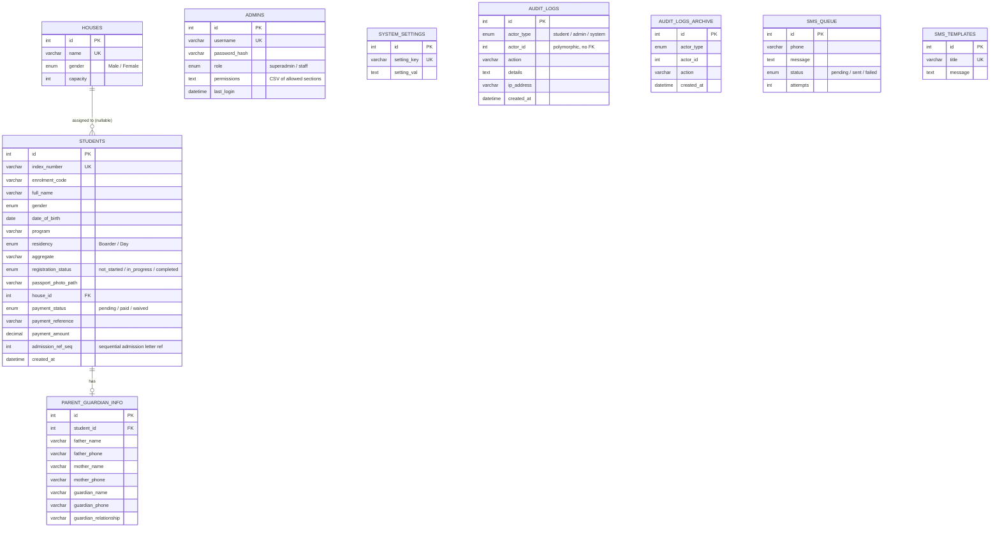

# CDTI Online Admission Portal

PHP/MySQL admission portal for student placement verification, online registration, Paystack payments, SMS notifications, auto-generated PDF documents (admission letter, bond/undertaking form, personal record, prospectus), and a role-based admin dashboard.

Built for **Charlotte Dolphyne Technical Institute (CDTI)**, deployed on Hostinger (LiteSpeed).

---

## Table of contents

- [Requirements](#requirements)
- [Entity-Relationship Diagram](#entity-relationship-diagram)
- [Folder structure](#folder-structure)
- [Local development (Laragon)](#local-development-laragon)
- [Environment variables (.env)](#environment-variables-env)
- [Deployment (production)](#deployment-production)
- [Migration order](#migration-order)
- [Paystack webhook](#paystack-webhook)
- [SMS cron (Hubtel)](#sms-cron-hubtel)
- [Audit log retention cron](#audit-log-retention-cron)
- [Content-Security-Policy notes](#content-security-policy-notes)
- [Security notes](#security-notes)
- [Health check](#health-check)
- [Support](#support)

---

## Requirements

- PHP 8.0+ (developed/tested on 8.3)
- MySQL 5.7+ / MariaDB 10.3+ — **note:** `ADD COLUMN IF NOT EXISTS` is MariaDB-only syntax and errors on real MySQL; all auto-migrations in this codebase use a plain `ADD COLUMN` wrapped in try/catch instead, so either engine works
- Apache or LiteSpeed with `mod_rewrite` + `mod_headers`
- cURL extension (Paystack, Hubtel SMS)
- CLI access for migrations and the SMS cron worker

## Entity-Relationship Diagram



`ADMINS`, `SYSTEM_SETTINGS`, `AUDIT_LOGS`, `AUDIT_LOGS_ARCHIVE`, `SMS_QUEUE`, and `SMS_TEMPLATES` are intentionally standalone — `audit_logs.actor_id` is polymorphic (student or admin) so it isn't a real foreign key, and the others are simple lookup/queue tables with no relational dependency on `STUDENTS`.

## Folder structure

```text
.
├── admin/                     Admin panel (role-gated via requirePermission())
│   ├── assets/                Admin-only CSS/JS (theme toggle, admin.css)
│   ├── includes/              sidebar.php, topbar.php (shared admin chrome)
│   ├── index.php              Admin login
│   ├── dashboard.php          Stats + charts
│   ├── students.php           Student list, search, filters, CSV export
│   ├── student_view.php       Single student edit (house/residency/program)
│   ├── houses.php             Boarding house CRUD
│   ├── import.php             CSV placement data import
│   ├── sms.php                Bulk SMS + templates
│   ├── settings.php           School info, uploads, payment, SMS config (tabbed)
│   ├── users.php              Admin user management (RBAC)
│   ├── profile.php            Current admin's own profile
│   └── logout.php / login.inc.php
│
├── assets/                    Public-facing CSS/JS/images/particles
├── cron/                      CLI-only workers (see Cron sections below)
│   ├── send_sms.php           Drains sms_queue every minute, file-locked
│   └── purge_audit_logs.php   Monthly audit_logs retention/archival
│
├── includes/                  Shared bootstrap
│   ├── db.php                 PDO connection (auto-detects local vs production)
│   ├── db_prod.php.template   Copy to db_prod.php on the server (gitignored)
│   ├── env.php                Minimal .env loader
│   ├── secrets.php            AES-256-GCM encrypt/decrypt for stored API keys
│   └── helpers.php            Auth, CSRF, CSP header, flash messages, misc utilities
│
├── migrations/                One-shot SQL/PHP migrations (see Migration order)
├── pdf/                       Server-rendered HTML → browser-print-to-PDF documents
│   ├── generate_letter.php    Admission letter (sequential CDTI/ADM/<year>/#### ref)
│   ├── generate_bond.php      Bond / Undertaking form
│   ├── generate_record.php    Personal Record form
│   └── generate_prospectus.php
│
├── seeds/                     seed.php — default admin + settings for a fresh DB
├── tests/                     Lightweight smoke tests (run_tests.php), access-blocked via .htaccess
├── uploads/                   Runtime-created, gitignored except folder placeholders
│   ├── passports/             Student passport photos
│   └── settings/              Logo, letterhead, signatures, stamp, prospectus PDFs
│
├── admissions.php             Student login (CSSPS index number)
├── autenticate.php            Student login handler (POST target)
├── register.php               Multi-step registration form (after payment)
├── payment.php / payment_verify.php   Paystack Inline checkout + verification
├── paystack_webhook.php       Server-to-server payment confirmation (HMAC-verified)
├── dashboard.php              Student post-registration dashboard
├── search.php / save_nf.php   "Find my name" unlisted-student search flow
├── index.php / logout.php
├── health.php                 GET /health — uptime monitor endpoint
├── setup.php                  One-time local installer (self-blocks outside localhost)
├── .env.example                Environment variable template
├── .htaccess                   Pretty URLs, security headers, sensitive-file blocking
└── QA_FULL_AUDIT_REPORT.md     Security/QA audit — see Support section
```

## Local development (Laragon)

1. Clone the project into your web root (e.g. `C:\laragon\www\cdti-online-admission-portal`).
2. Start Laragon (Apache + MySQL).
3. Run initial setup via `setup.php` on **localhost only**, or apply schema manually:
   ```bash
   mysql -u root -P 3307 < migrations/001_create_tables.sql
   php seeds/seed.php
   ```
4. Open your Laragon vhost URL.
5. Admin panel: `/admin/` — default local credentials are created by `setup.php` or `seeds/seed.php` (`admin` / `admin123` — **change immediately**).

Local database defaults are in `includes/db.php` (host `localhost`, port `3307`, database `kimtech_admission`, user `root`, empty password).

## Environment variables (.env)

A `.env` file in the project root is loaded automatically at bootstrap via `includes/env.php`. It is blocked from public access by `.htaccess`.

```bash
cp .env.example .env
```

| Variable | Purpose |
|---|---|
| `APP_ENV` | Set to `production` to hard-block `setup.php` |
| `KIMTECH_SECRET_KEY` | AES-256-GCM key for encrypting stored API secrets (base64, 32 bytes) |
| `CRON_ALERT_EMAIL` | Receives an email if the SMS cron job crashes |

Generate a secret key:
```bash
php -r "echo base64_encode(random_bytes(32));"
```

On **Hostinger**: set env vars in hPanel → Advanced → PHP Configuration → Environment Variables (no `.env` file needed).

## Deployment (production)

1. Upload all files to the web root **including `.htaccess`** — it's a hidden dotfile, so make sure your FTP client or File Manager is set to show hidden files. A missed `.htaccess` upload silently falls back to a stale/absent security-header policy and pretty-URL routing breaks.
2. Copy `includes/db_prod.php.template` → `includes/db_prod.php` on the server and set production credentials:
   ```php
   define('DB_HOST', 'localhost');
   define('DB_PORT', 3306);
   define('DB_NAME', 'your_database');
   define('DB_USER', 'your_user');
   define('DB_PASS', 'your_password');
   ```
   `db_prod.php` is gitignored and must exist on the server — production fails with a clear error if it's missing.
3. **Rotate the database password** if credentials were ever committed to git history.
4. Apply schema and migrations in order (see [Migration order](#migration-order)).
5. Configure Paystack keys in **Admin → Settings → Payment**.
6. Register the Paystack webhook URL (see below).
7. Set up the SMS cron job (see below).
8. **Delete `setup.php`** from the production server after installation (it self-blocks once `db_prod.php` exists or the host isn't localhost, but removing it entirely is the safest option).
9. Ensure `uploads/` is writable by the web server.
10. If hosted behind **LiteSpeed** (e.g. Hostinger): purge the LiteSpeed cache (hPanel → Websites → your site → Caching → Purge) after every deploy. Static/dynamic response caching at the server level can otherwise serve stale HTML or headers for several minutes after an upload.

## Migration order

Run these in order for a **new** database:

| Step | Command / file | Purpose |
|------|----------------|---------|
| 1 | `migrations/001_create_tables.sql` | Base schema (students, admins, settings, houses, audit logs) |
| 2 | `php migrations/add_payment_columns.php` | Payment columns on existing DBs (safe to re-run) |
| 3 | `php migrations/add_houses_migration.php` | `houses` table + `house_id` FK on legacy databases |
| 4 | `php migrations/add_sms_queue.php` | SMS queue table |
| 5 | `php migrations/add_permissions.php` | Admin RBAC `permissions` column |
| 6 | `php seeds/seed.php` | Default settings and admin (optional for fresh install) |

Fresh installs using the current `001_create_tables.sql` already include payment columns; step 2 is idempotent for upgrades. `sms_templates` and `students.admission_ref_seq` are created automatically on first use (see `admin/sms.php` and `pdf/generate_letter.php`) — no separate migration needed.

Example (CLI):

```bash
cd /path/to/cdti-online-admission-portal
mysql -u USER -p DATABASE < migrations/001_create_tables.sql
php migrations/add_payment_columns.php
php migrations/add_houses_migration.php
php migrations/add_sms_queue.php
php migrations/add_permissions.php
php seeds/seed.php
```

## Paystack webhook

1. In [Paystack Dashboard](https://dashboard.paystack.com/) → **Settings → API Keys & Webhooks**.
2. Set the webhook URL to:
   ```
   https://your-domain.com/paystack_webhook
   ```
3. Ensure the **secret key** and **public key** are saved in Admin → Settings → Payment.
4. The webhook verifies `X-Paystack-Signature` (HMAC SHA-512) and processes `charge.success` events.
5. Payment metadata must include `student_id` (set automatically in `payment.php`).

Student return URL after payment: `/payment_verify?ref=...` (handled by the Paystack Inline JS callback).

## SMS cron (Hubtel)

SMS messages are queued in `sms_queue` and sent by a CLI worker.

Add a cron job to run **every minute**:

```cron
* * * * * php /home/USERNAME/public_html/cron/send_sms.php >> /dev/null 2>&1
```

Adjust the path to your Hostinger `public_html` directory. The script refuses web requests and uses a file lock (`cron/send_sms.lock`, gitignored) to prevent overlapping runs.

Configure Hubtel credentials in **Admin → Settings → SMS** (`hubtel_client_id`, `hubtel_client_secret`, `hubtel_sender_id`).

## Audit log retention cron

To prevent unbounded growth of the `audit_logs` table, run the purge script monthly:

```cron
0 2 1 * * php /home/USERNAME/public_html/cron/purge_audit_logs.php >> /dev/null 2>&1
```

Rows older than 12 months are moved to `audit_logs_archive` before deletion.

## Content-Security-Policy notes

Every page emits its own per-request, nonce-based CSP via `emitCspHeader()` in `includes/helpers.php`; `.htaccess` carries a **fallback-only** copy using `Header setifempty` (not `Header always set`). This distinction matters: Apache/LiteSpeed's `Header always set` unconditionally overrides whatever PHP's `header()` call already sent for the same header name — using it for the CSP line would silently discard every page's nonce'd policy in favor of the static one, breaking any inline `<script>`/`<style>` that relies on the nonce. Keep `.htaccess` and `emitCspHeader()` in sync if you change either (in particular, `payment.php` uses `emitCspHeader(true)` to relax `script-src` for Paystack Inline JS, which injects its own unnonceable `<script>` tag).

## Security notes

- Never commit `includes/db_prod.php`, `.env`, or real secrets.
- Remove `setup.php` from production after go-live.
- Keep `uploads/.htaccess` in place to block script execution inside the uploads directory.
- Change the default admin password (`admin` / `admin123`) immediately after first login.
- Inline event-handler attributes (`onclick=`, `onchange=`, etc.) are always blocked by the nonce'd CSP regardless of nonce placement — wire up interactivity with `addEventListener` inside a nonce'd `<script>` block instead.

## Health check

```
GET https://your-domain.com/health
```

Returns `200 {"status":"ok"}` when the database is reachable, `503 {"status":"degraded"}` otherwise. Use with any uptime monitor (UptimeRobot, Better Uptime, etc.).

## Support

See `QA_FULL_AUDIT_REPORT.md` for the full security and QA audit, production readiness checklist, and remediation roadmap.
